# Bookshelf Recognization
基于BookShelf Structure损伤识别实验,结果见[实验过程及结果](index.ipynb)

## 环境

- python3
- tensorflow >= 1.10
- numpy
- scikit-learn
- scipy
- seaborn
- pandas

## 数据集介绍
该模型是一个三层结构框架模型，尺寸大小如图1所示。

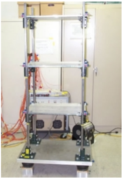

该模型结构由支柱和铝制板构成，最底层为1.3厘米（0.5英寸）厚铝板，
单支柱上有两个螺栓连接至托架，铝制板与支柱通过螺栓相连进行固定，
传感器布置的位置及其连接细节如图2所示。

.png) .png)

实验模型结构的维度如图3、4所示，所有螺栓连接均在未损坏状态下紧固
0.7nm(60英寸磅)的扭矩。在四个角的底部安装了空气隔离器，允许结构在
水平方向上自由移动。对隔离器进行充气，使压强达到0.14MPa，同时进行
调整，使结构与振动器保持水平。该振动器通过一个长15cm，直径为9.5mm
的圆管通过各层中间的螺纹孔连接到底板上。如图4所示，振动器安装在底
板角D处，以便激发平移和扭转运动。

## 实验步骤

该实验共分为3个部分：

1.  基于过滤式的特征提取（指标用信息增益率）
2.  利用ARMA模型的自相关函数以及偏自相关函数确定LSTM步数
3.  利用双向LSTM作损伤识别

### 1. 基于过滤式的特征提取

这里用信息增益率作为过滤式特征选择的指标。主要是考虑到结构数据很多时候离散数据和连续数据兼有，用互信息又会被类别多少左右，所以参造C4.5算法对ID3的改进，这里选择信息增益率。

用信息增益率（用熵指标应该都会遇到）面临的另一个问题就是连续数据的处理。这里有两个思路：

1.  将数据离散化，利用离散分布建模
2.  直接用连续分布建模

#### 数据离散化方式

> 基本参照C4.5算法的离散化方式

#### 连续分布建模

> 借鉴GDA的思想，直接用生成模型建模。但不一定会用高斯分布建模，在建模之前，会用卡方检验检验其分布的适用性，如果P值小于显著性水平，就换一种分布，直到零假设成立为止(或者直接用分布族建模)。在求出分布之后，即可用连续分布求出信息增益率

#### 最终结果

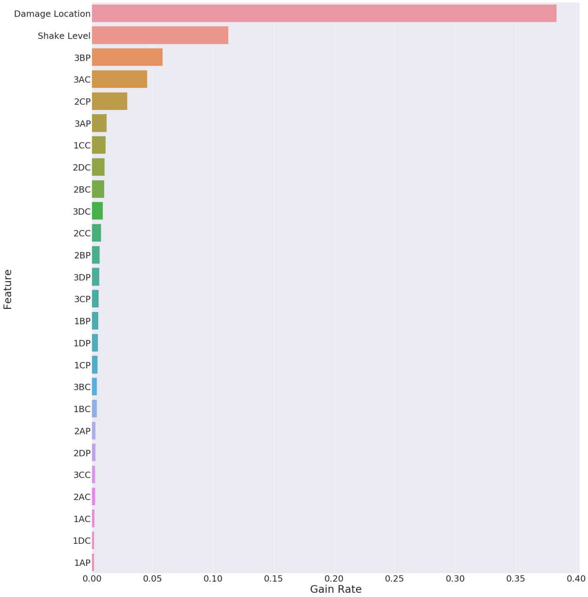

### 2. 利用ARMA模型的自相关函数和偏自相关函数确定LSTM步数

借鉴于ARMA模型的其中一种定阶方式，所选模型遵循两个原则：

1. 时间复杂度尽量小（因为是采样计算，不存在空间复杂度的问题）
2. 这里的目的仅是定阶，而非建立一个ARMA模型,所选步骤尽量“轻”，换句话说，就是越不依赖ARMA模型本身越好

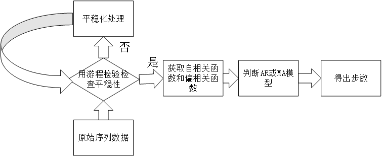

#### 2.1 平稳化处理

一般采集的结构数据都有周期性，所以这里差分和季节差分同时使用，差分取1阶，季节差分取2阶，季节周期取10，下面是平稳化处理前和处理后的对比：

**平稳化处理前**

**平稳化处理后**

#### 2.2 游程检验

这一步主要是用游程检验检验平稳化后的数据是否平稳。之所以选择游程检验是因为游程检验计算快，不需要先验分布的假设，又不依赖于ARMA模型本身。下表是游程检验的结果（显著性水平取0.05）：

|          | Z值               | p值                 |
| -------- | ----------------- | ------------------- |
| 游程检验 | 1.424596135527278 | 0.15427397776693086 |

#### 2.3 截尾拖尾判定

此步是ARMA模型中的一个步骤，用于判断阶数是取自相关函数还是取偏自相关函数

#### 2.4 阶数判断

同样通过假设验证取阶数（显著性水平取0.05）

**最终结果**（上图是ACF，下图是PACF）：

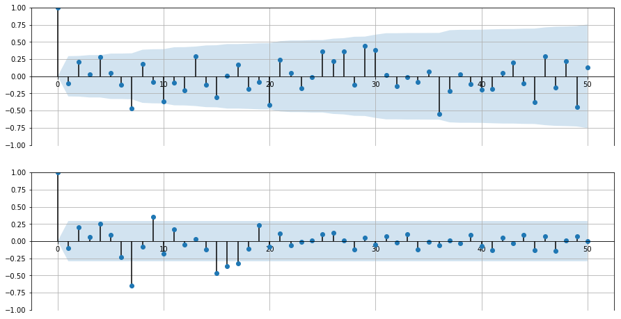

### 3. 损伤识别

DNN、LSTM，Bidirectional-LSTM，作横向对比

#### 3.1 DNN

##### 3.1.1 超参数 

| 超参数名称           | 值                           |
| -------------------- | ---------------------------- |
| 训练与验证集比例     | 8:2                          |
| 模型优化算法         | Adam                         |
| 学习率               | 从0.01开始手工调试           |
| RMSProp参数项        | 0.999                        |
| 动量因子             | 0.9                          |
| Batch样本数          | 512                          |
| 待训练参数W初始化    | 零均值高斯分布分布随机初始化 |
| 待训练参数b初始化    | 初始化为0                    |
| 隐藏层               | [30,15,15]                   |
| 隐藏层Activation     | Relu                         |
| 输出层Activation     | softmax                      |
| Inverted Dropout比率 | 0.2                          |

##### 3.1.2 Loss

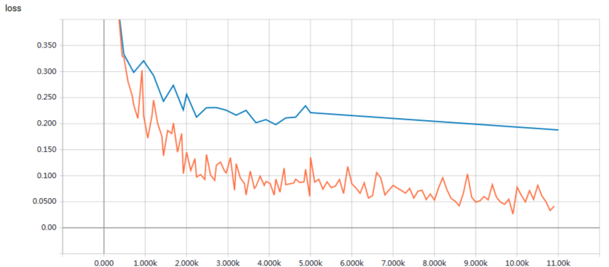

##### 3.1.3 Accuracy

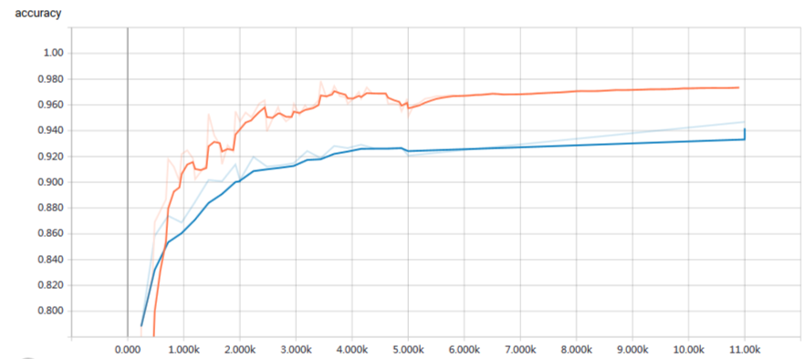

#### 3.2 LSTM

##### 3.2.1 超参数

| 参数              | LSTM损伤识别模型                       |
| ----------------- | -------------------------------------- |
| 训练与验证集比例  | 8:2                                    |
| 模型优化算法      | Adam                                   |
| 学习率            | 从0.01开始手工调试                     |
| RMSProp参数项     | 0.999                                  |
| 动量因子          | 0.9                                    |
| Batch样本数       | 128                                    |
| 待训练参数W初始化 | 零均值高斯分布分布随机初始化           |
| 待训练参数b初始化 | 初始化为0                              |
| 隐藏层            | [30,20]                                |
| 隐藏层Activation  | Relu                                   |
| 输出层Activation  | softmax                                |
| Dropout比率       | 0.2                                    |
| LSTM层所在位置    | 在隐藏层之前，即顺序为 LSTM层 → 隐藏层 |

##### 3.2.2 Loss

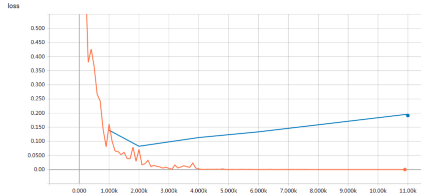

##### 3.2.3 Accuracy

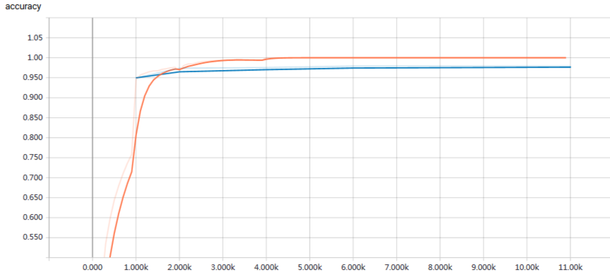

#### 3.3 Bi-LSTM

##### 3.3.1 超参数

| 参数               | Bi-Directional LSTM损伤识别模型            |
| ------------------ | ------------------------------------------ |
| 训练与验证集比例   | 8:2                                        |
| 模型优化算法       | Adam                                       |
| 学习率             | 从0.01开始手工调试                         |
| RMSProp参数项      | 0.999                                      |
| 动量因子           | 0.9                                        |
| Batch样本数        | 128                                        |
| 待训练参数W初始化  | 零均值高斯分布分布随机初始化               |
| 待训练参数b初始化  | 初始化为0                                  |
| 隐藏层             | [30,20]                                    |
| 隐藏层Activation   | Relu                                       |
| 输出层Activation   | softmax                                    |
| Dropout比率        | 0.2                                        |
| 双向LSTM层所在位置 | 在隐藏层之前，即顺序为双向 LSTM层 → 隐藏层 |

##### 3.3.2 Loss

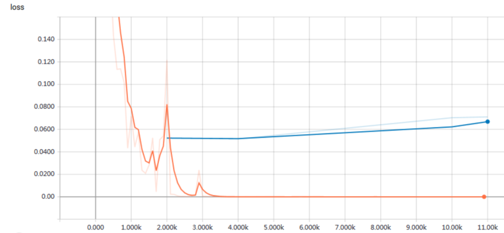

##### 3.3.3 Accuracy

##### 3.3.4 Learning Rate

### 4. 识别结果

##### 4.1 ACC(验证集)

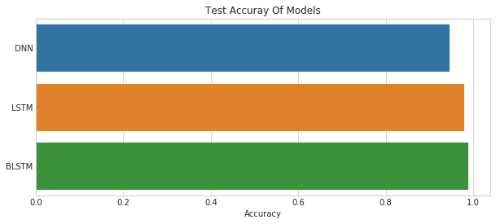

##### 4.2 验证集混淆矩阵

 		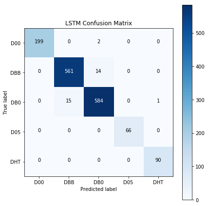

##### 4.3 ROC

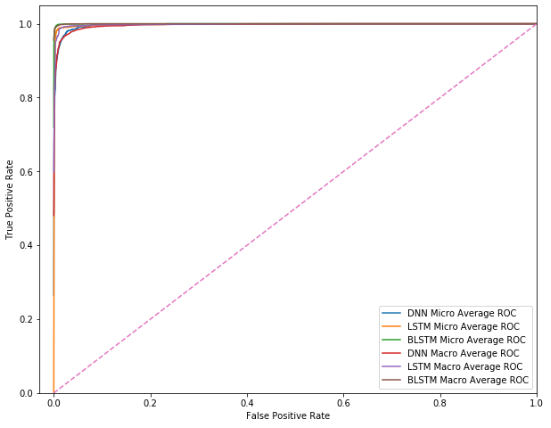

##### 4.4 AUC

| 指标模型  | DNN       | LSTM     | BLSTM    |
| --------- | --------- | -------- | -------- |
| Micro AUC | 0.886951  | 0.997907 | 0.999838 |
| Macro AUC | 0.9966190 | 0.998059 | 0.999636 |

